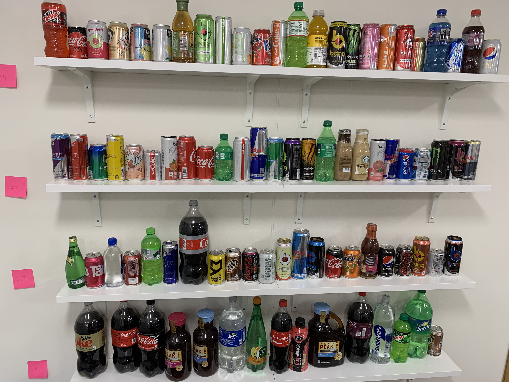
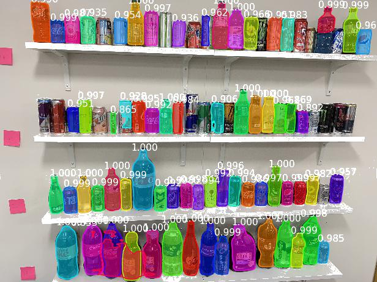

# CloMask - Mask R-CNN for Rigid/Non-Rigid Retail Consumables

## Table of Contents

1. [Introduction](#introduction)
1. [Directory Structure](#directory-structure)
1. [Contributors](#contributors)
1. [References](#references)

## Introduction

Clomask is a product that uses object detection, segmentation and classification for retail products. The goal is to semantically segment retail products such as soda bottles, candy bags and cereal boxes in images using deep-learning based mask-detection.

| Sample Input | Sample Output |
|--------------|---------------|
|  |  |

## Directory Structure

```
.
├── data-acquisition
├── research
├── mrcnn
├── model_server
└── webapp
```

### Data Acquisition

A major challenge was to acquire enough data without spending too much time/effort in manual labeling. The data acquisition module attempts to achieve the generation of large-scale, reproducible image/mask datasets with a high degree of variance.

### Research

The COCO dataset only has `bottle` (out of the other retail products we needed to segment, such as `bag` and `box`), and thus we needed to retrain the model on newer data. This section covers our experiments, learnings and results from the training and validation process.

### MRCNN

This is a sub-repo that contains the Mask RCNN implementation files, modified for Clomask's use.

### Model Server

In order to serve the model over the web, we use AWS to accept requests and generate the mask files on a private S3 bucket. These can be accessed through pre-signed URLs.

### Web App

The web app simply deploys and serves our final model in an end-to-end fashion where a user can upload an image and get the view the annotated image as the result.

## Contributors

 * [Havan Agrawal](https://github.com/havanagrawal)
 * [Purshottam Shivraj](https://github.com/pshivraj)
 * [Tejas Hosangadi](https://github.com/tejasmhos)
 * [Toan Luong](https://github.com/lmtoan)
 * [Vishnu Nandakumar](https://github.com/vivanvish)

## References

### Literature

1. [Fast R-CNN -  Ross Girshick](https://arxiv.org/abs/1504.08083)
1. [Faster R-CNN: Towards Real-Time Object Detection with Region Proposal Networks - Shaoqing Ren, Kaiming He, Ross Girshick, Jian Sun](https://arxiv.org/abs/1506.01497)
1. [Mask R-CNN - Kaiming He, Georgia Gkioxari, Piotr Dollár, Ross Girshick](https://arxiv.org/abs/1703.06870)

### Implementations

1. [facebookresearch/detectron](https://github.com/facebookresearch/Detectron)
2. [matterport/Mask_RCNN](https://github.com/matterport/Mask_RCNN)
