# Data Acquisition and Curation

**Owner**: [Vishnu Nandakumar](https://github.com/vivanvish)  

### Overview
Even though the pretrained model gives decent results for recognizing bottles, it falters when the bottles are aligned differently. So to tackle this we need to train the model again on augmented images.

The images have been collected from google images, using this package: [google-images-download
](https://github.com/hardikvasa/google-images-download). 

### Labeling
There are two tools that looks promising for manually marking the Masks:
- [LabelMe](http://labelme.csail.mit.edu/Release3.0/)
    - OpenSource
    - Only supports JPEG
    - Annotations are in exportable in XML format.
- [Supervisely](https://supervise.ly/)
    - Free and Paid version.
    - Supports multiple image formats.
    - Annotations can be exported in multiple formats.
**IMP**: Irrespective of the tool we use, the each individual mask should be named as **bottle**. 
### LabelMe Workflow
- Step 1: Create an account.
- Step 2: Create a collection (named bottles or something.)  
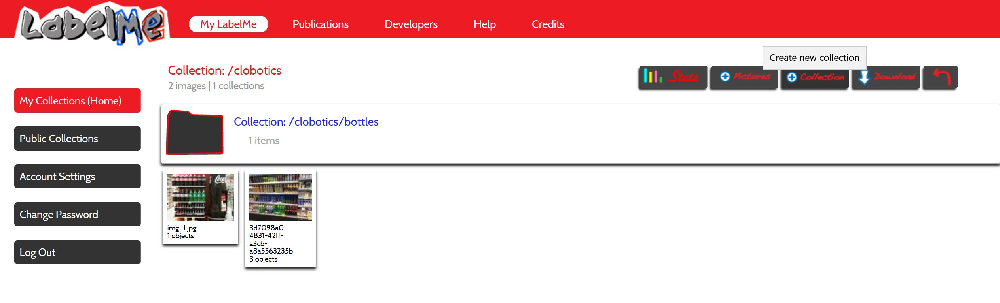
- Step 3: Add pictures. Currently it supports uploading from local machine only. So make sure that your data is present in the machine from which you are accessing the tool. Also it supports only .JPEG format.
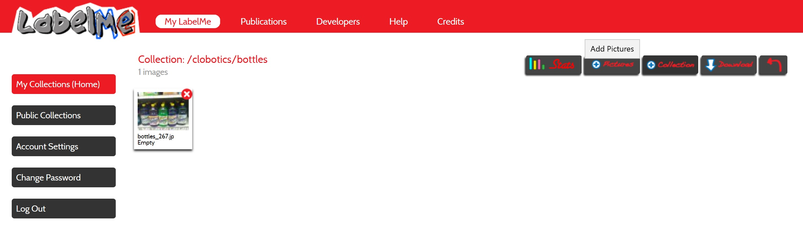
- Step 4: If you click on any images there, you will be taken to the annotation tool. From the toolbar on the left, select the polygon tool (highlighted).
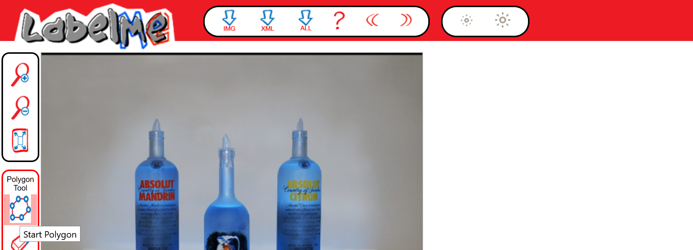
-  Step 5: Draw the mask by drawing the approximate boundary over the object. 
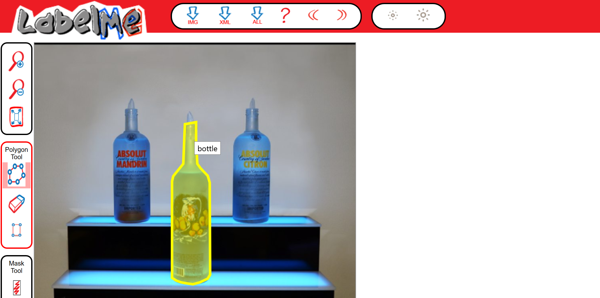
- Step 6: Save the mask by clicking **Done**. Since we are going to mark only bottles, make sure that the name for all masks is **bottle**.
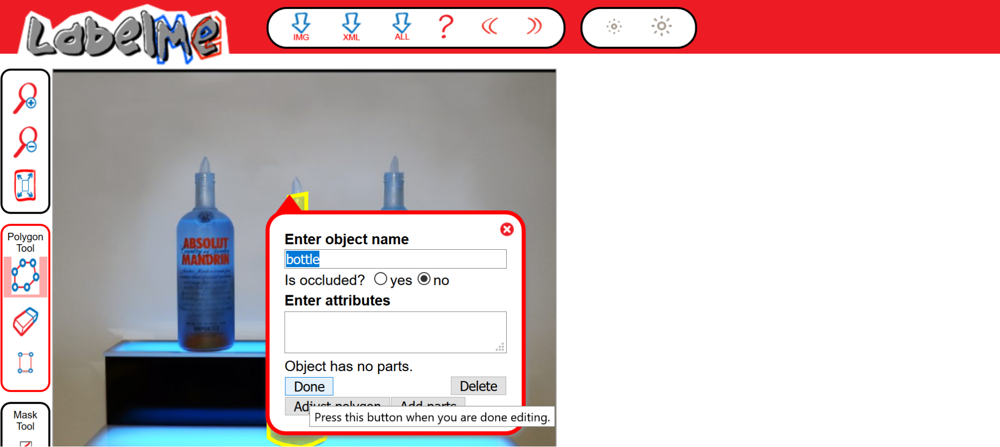
- Step 8: Continue steps 5-7 till all the bottles in the image are marked.
- Step 9: Once this is done for all images, we can download the masks for the entire collection. Click Download to start the download process.
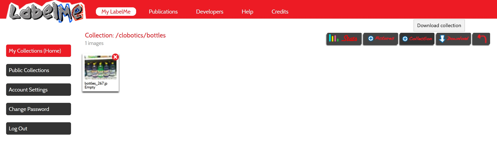
- Step 10: Make sure that both options are selected before downloading.
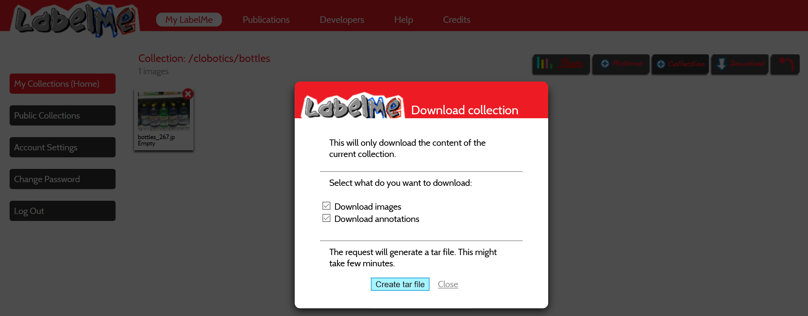

**Notes**  
The tool was a bit flaky on Firefox. I would recommend Chrome for this.

### Supervisely Workflow
- Step 1: Create an account.

- Step 2: Drag a folder containing the images to be labelled into the upload dropbox. These are the images that will be labelled using the Supervisely platform. 

  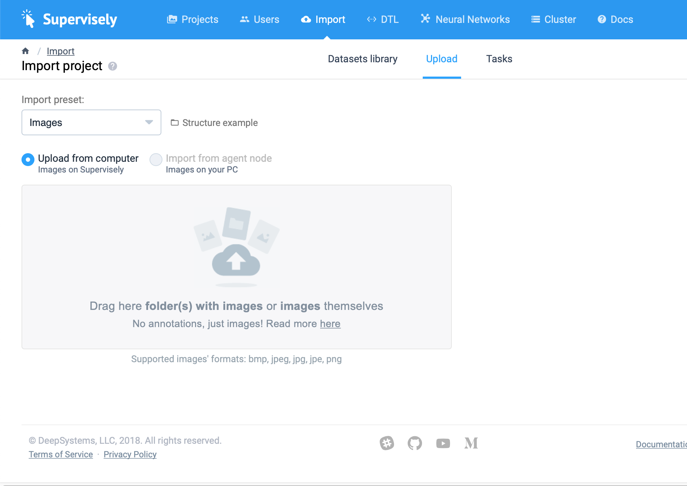

- Step 3: Go to the projects page and click on the project you just created.

  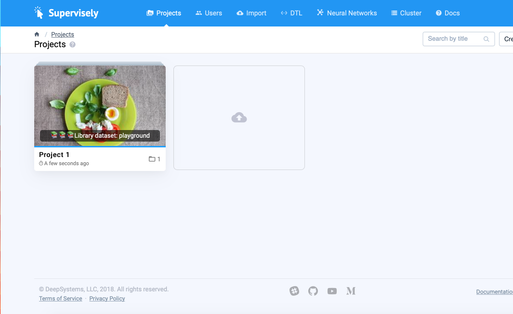

- Step 4: Select the dataset that you want to use in the given project.

  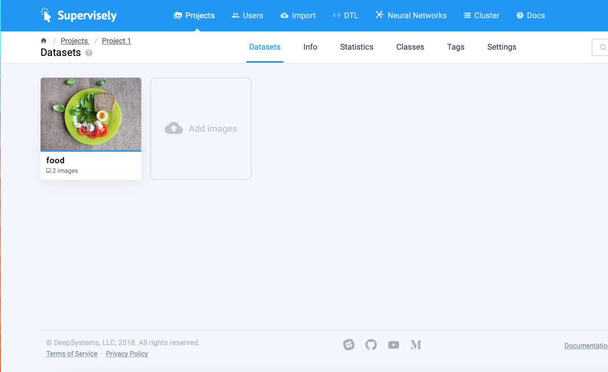

- Step 5: Begin the labeling process. One way you can label is using the rectangle tool to create bounding boxes.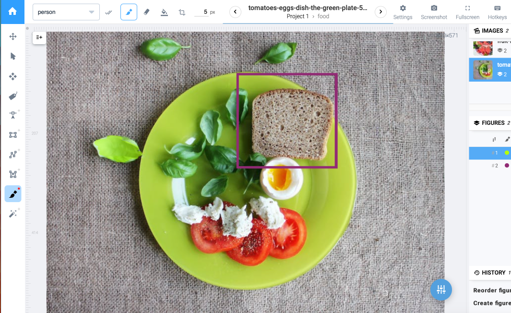

You can also label using the the bitmap tool (the brush on the left hand toolbar) if you want to create masks instead of bounding boxes (observe the purple mask on the leaf).

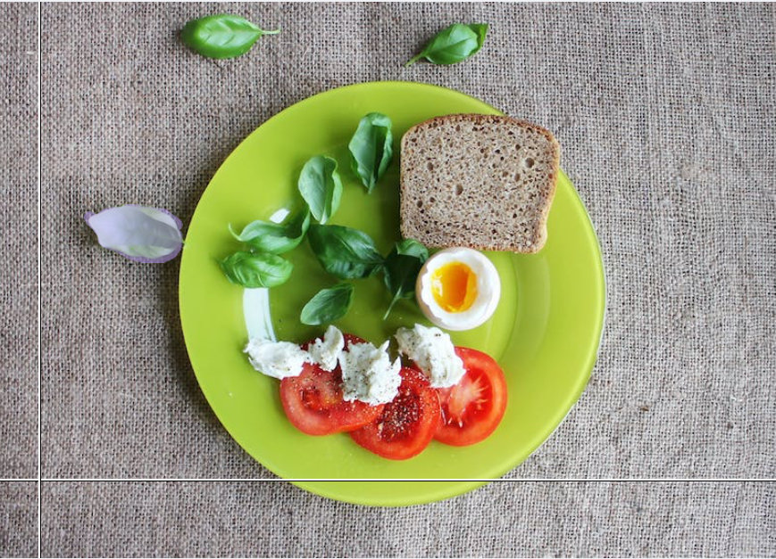

- Step 6: Repeat step 6 till all objects are labeled. 

- Step 7: When you are done and ready to download the data, go back to the project page and click the three dots lined up to form a vertical line. You have three options, you can download as JSON, masks or transform. 

  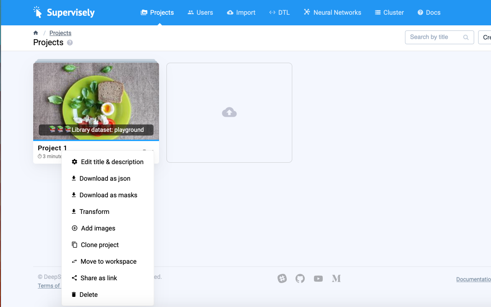

- Step 8: Regardless of the option that you choose, you will be directed to a page where you will be prompted to start the DTL process. Hit start on this page. 

  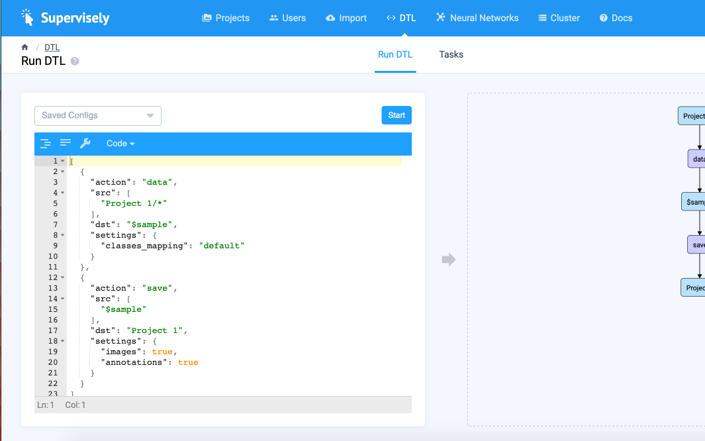

- Step 9: After this is done, you can download the result after the process is complete.

  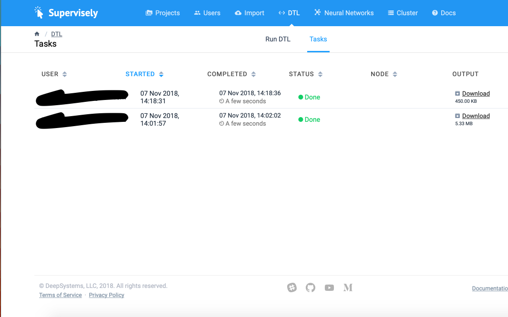

### Mask generation
Individual masks will be generated from the annotations using the maskmaker module.

### Datastore

The annotated data will be store in a common location, probably a drive or in an S3 bucket. We can make this decision later.
