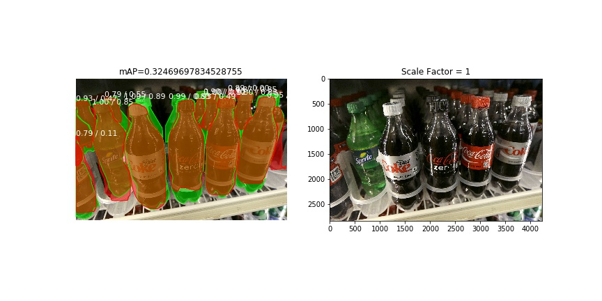

# Model Performance w.r.t. Image Resolution

## Background

In the meeting with Clobotics on 21st December, it was noted that image resolution may be a factor in the performance of the model, which seems intuitive. Unclear/blurry images will result in lower performance (as measured by mAP). This section is a formal analysis of the effect of image resolution on mAP.

## What is Resolution?

In the context of images, we can use two definitions of resolution:
1. **Pixel resolution** is the literal number of pixels in the image. This is the most common usage. An image of 1024x1024 resolution literally means it is 1024 pixels wide and 1024 pixels high, for a total of 1048576 pixels, ~3MB (uncompressed) or 214kB (compressed JPG).
2. **Spatial resolution** is the smallest discernible detail in the image. This is colloquially the clarity of the image; blurry images have lower spatial resolution, even though they may have the same pixel resolution as a clear image.

For this analysis, we use both definitions. From the context of a user clicking photos, the first one is determined by their camera quality, and the second is controlled by how well the camera can focus on an image.

## High Variance in Results

Prediction on the same image can sometimes result in different masks, and consequently different precision values. While this might require some analysis of its own, it is not so variant as to nullify the results of this one. In general, we see the average precision for a single image vary by 0.025 in either direction.

## Results

The images on the left are the result of the model, with the following legend:

 * Green: Ground Truth/Actual Masks
 * Red: Predicted Masks
 * Numbers: Score/IoU. Score is the probability of the mask being a bottle, and the IoU is the intersection over union score of the mask with the ground truth mask.

The images on the right are the input images to the model. Note the axes for both of the following sections.

### Pixel

Reducing pixel resolution has limited effect on performance. We see insignificant changes in the mAP when reducing the resolution, even when reduced to ~10% of its original dimensions. However, making it smaller than ~100x100 deteriorates the performance significantly.

The original image for this analysis had a `height = 2826`, and a `width = 4224`.

**Note** that the axes on the original images (on the right) have different scales, indicating different pixel resolutions.

* At `0.0125w x 0.0125h` (35x52)

* At `0.025w x 0.025h` (70x105)

* At `0.05w x 0.05h` (141x211)

* At `0.5w x 0.5h` (1413x2112)

* At `w x h` (2826x4224)

### Spatial

Reducing spatial resolution has a visible impact on the precision, which is intuitive; unclear images would make it difficult for low level feature extraction in the earlier layers of the model.

To simulate lower spatial resolution, the image is first reduced to a smaller pixel resolution, and then scaled back to the original dimensions. In image upscaling, interpolation and sampling algorithms are used to fill in pixels.

We use the term `scale factor` to describe how small the image was made before rescaling it back. A `scale factor = 0.01` would mean our image is first scaled to `282 x 422`, and then scaled back to `2826 x 4224`.

The original image for this analysis had a `height = 2826`, and a `width = 4224`.

**Note** that the axes on the original images (on the right) have the same scale, indicating that they all have the same pixel resolution, but vary in quality.

* At `0.01` scale factor:

* At `0.02` scale factor:

* At `0.05` scale factor:

* At `0.10` scale factor:

* At `0.50` scale factor:

* At `1.00` scale factor:

