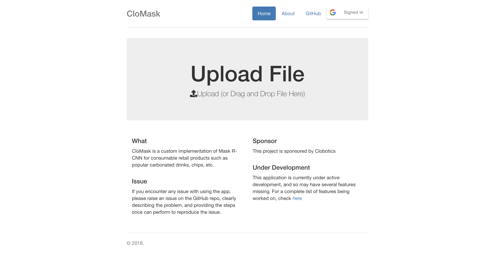

# The Web App

**Owner**: [Havan Agrawal](https://github.com/havanagrawal)

## Working

1. Sign-in with Google authenticates the user, and uses AWS Cognito's Federated Identity Pool
2. Drag-drop/select image uploads the file to the browser
3. The browser uses the previously obtained auth values to create an S3 connection and uploads the file to S3
4. **TODO**: A trigger sends the file from S3 to the model
5. **TODO**: The model generates the mask, and uploads it to another S3 bucket
6. **TODO**: The browser makes a blocking call to S3 for the mask image, with a timeout of 30 seconds.
7. **TODO**: The browser renders the mask (possibly overlaid on the original image)

## Libraries

1. The AWS SDK for Javascript
2. Bootstrap
