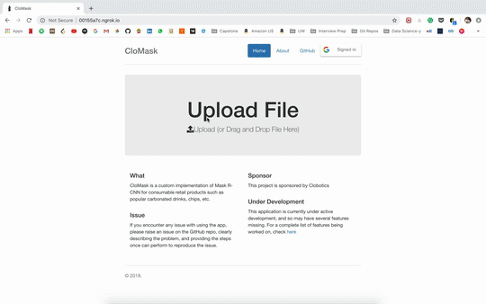

# The Web App

**Owner**: [Havan Agrawal](https://github.com/havanagrawal)

## Table of Contents

1. [Introduction](#introduction)
1. [Working](#working)
1. [How to Deploy](#how-to-deploy)
    1. [Prerequisites](#prerequisites)
    1. [Infrastructure](#infrastructure)
    1. [Deployment](#deployment)
1. [Libraries](#ui-libraries)

## Introduction

The web app provides a way to showcase the Mask RCNN model wrapped up in a web UI.



**Note:** This is the architecture that we came up with as an end-to-end solution, which will eventually scale well. However, if scalability isn't a hard requirement, the architecture can be simplified to a great extent, packaging the web app and the model serving in a single script.

## Working

1. Sign-in with Google authenticates the user, and uses AWS Cognito's Federated Identity Pool
2. Drag-drop/select image uploads the file to the browser
3. The browser uses the previously obtained auth values to create an S3 connection and uploads the file to S3
4. A trigger sends the file from S3 to the model
5. The model generates the mask, and uploads it to another S3 bucket
6. The browser makes a blocking call to S3 for the mask image, with a timeout of 30 seconds.
7. The browser renders the mask (possibly overlaid on the original image)

## How To Deploy

### Prerequisites

1. An AWS account
1. A domain server with forwarding (`ngrok` is strongly recommended, used by this example)
1. Google API and Services account, with valid credentials [Optional]

### Infrastructure

1. S3 Bucket named `clomask-input`, the location to which user-uploaded images will be uploaded.
1. S3 Bucket named `clomask-output`, the location to which annotated images will be written.
1. SQS Queue named `clomaskInput`, the trigger queue from where the model server is loaded.
1. EC2 instance, the instance actually running the model. If this is equipped with a GPU, one can expect sub-second inference. A regular micro/small instance responds within a few seconds.

### Deployment

#### Model Server

1. Update the [config.py](./model_server/config.py) file with the above infrastructure details.
1. SCP the [`model_server`](./model_server) directory to the EC2 instance.
1. SSH to the EC2 instance, and cd into the `model_server` directory.
1. Run the [`install_mrcnn.sh`](./model_server/install_mrcnn.sh) script.
1. Install requirements:
    1. `pip3 install -r Mask_RCNN/requirements.txt`
    1. `pip3 install -r requirements.txt`
1. Start the model:
```bash
python3 model_server.py
```

#### Web Server

1. [Optional] SCP the web app to an EC2 instance and cd into it  
1. Start the server:
```bash
cd webapp
python3 -m http.server 8043
```  
1. Open up the web app to the internet:
```bash
./ngrok http 8043
```

## UI Libraries

1. The AWS SDK for Javascript
2. Bootstrap
